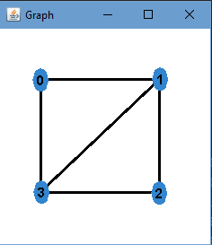
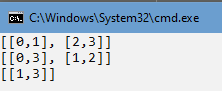
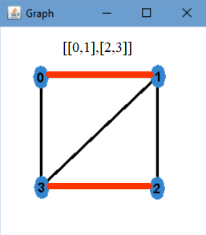
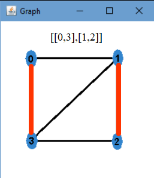
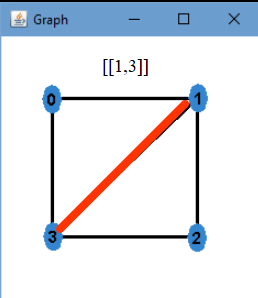
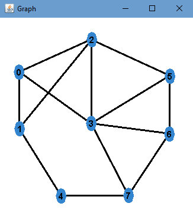
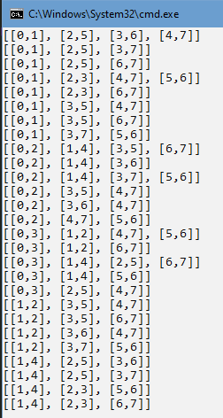

# Emparejamientos

> ***Pantoja Bustamante Gabriel***

<hr>

## Conceptos Preliminares

> En matemática discreta y en particular en la teoría de grafos, un apareamiento o conjunto independiente de aristas, también llamado emparejamiento o matching (en inglés), en un grafo es un conjunto de aristas independientes, es decir, sin vértices en común.

> **Emparejamiento Maximo:** Un apareamiento máximo es un apareamiento que contiene el número máximo posible de aristas. Puede haber muchos apareamientos máximos. El número de apareamiento de un grafo es el tamaño del apareamiento máximo.

> **Emparejamiento Maximal:** Un apareamiento maximal es un apareamiento M de un grafo G con la propiedad de que si alguna arista que no pertenece a M es añadido a M, no será ya un apareamiento. Nótese que todos los apareamientos máximos deben ser maximales, pero no todos los apareamiento maximales deben de ser máximos.

> **Emparejamiento Perfecto:** Un apareamiento perfecto es un apareamiento que cubre todos los vértices del grafo. Esto es, cada vértice está saturado bajo el apareamiento. Cada apareamiento perfecto es máximo y maximal.

[emparejamientos.](https://es.wikipedia.org/wiki/Apareamiento_(teor%C3%ADa_de_grafos))

Se intentara obtener todos los emparejamientos posibles, ya sean maximos, maximales o perfectos.

<hr>

## Algoritmo

Primeramente tomaremos dos vertices cualesquiera, estos formaran la primera arista del emparejamiento.

Posteriormente buscaremos todos los posibles emparejamientos sin tomar en cuenta los dos primeros vertices.

Para implementar esta idea se usa la representación del grafo como una lista de adyacencia.

Tambien se manejara un arreglo de booleanos para marcar los vertices que ya fueron usados.

Dado un vertice se formara una arista con algun adyacente, estos dos vertices seran marcados en el arreglo de booleanos y serán añadidos al conjunto parcial, luego se recorrerá el arreglo de booleanos buscando algun vertice que no haya sido usado, este vertice sera el nuevo vertice para la llamada recursiva.

Si se termino de recorrer todo el arreglo de booleanos, se verificará que el conjunto de aristas obtenido no se encuentre en la respuesta, debido a que el conjunto ***[(1,0), (2,3)]*** es igual al conjunto ***[(0,1),(3,2)]***, tambien se verificará si este conjunto esta completo, es decir que no haya aristas validas que no haya tomado en cuenta, si estas condiciones con validas se agrega el conjunto a la respuesta.

Luego de añadir el conjunto, se desmarcará los dos vertices que formán la ultima arista y serán eliminados del conjunto para ir a probar las otras opciones (backtracking).

```java
  @param v - vertice origen de la arista.
  @param arr - conjunto que guarda los posibles aristas de un emparejamiento.
  @param res - guarda todos los emparejamientos.
  @param visitados - controla los vertices que ya fueron usados.
  void emparejar(int v, ArrayList<Arista> arr, ArrayList<ArrayList<Arista>> res, boolean[] visitados)
```

<hr>

## Ejemplos

|<center>Grafo</center>|<center>Emparejamientos</center>
|----------------------|---------------------------------|
|||
|||
||

<hr>

|<center>Grafo</center>|<center>Emparejamientos</center>|
|----------------------|--------------------------------|
|||


